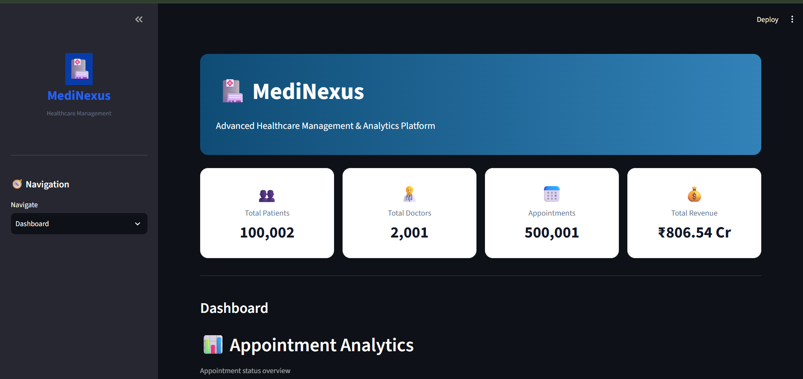
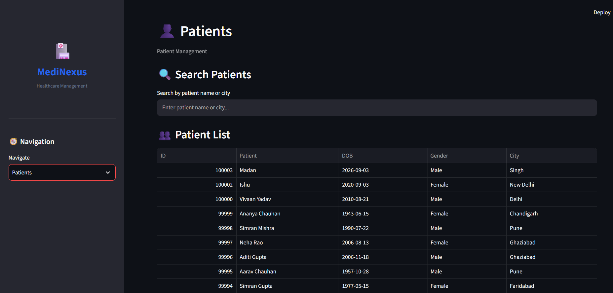
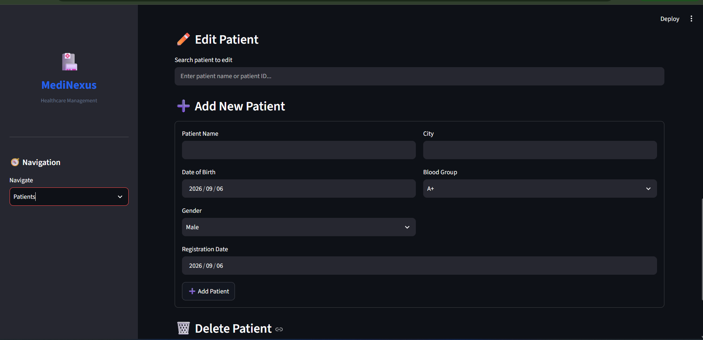
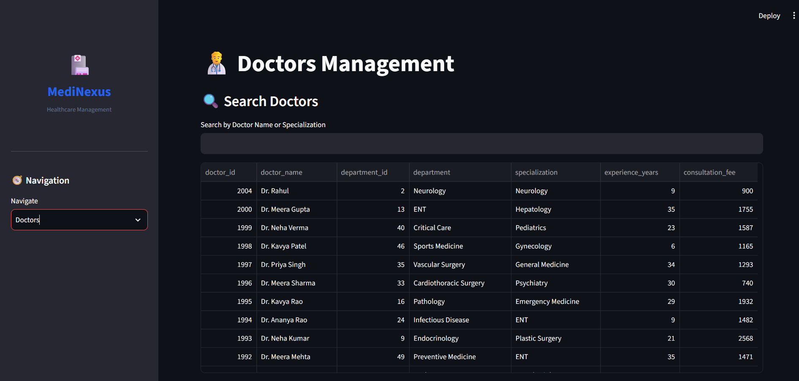
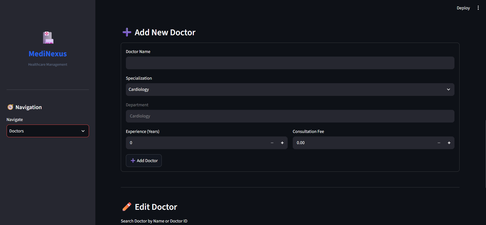
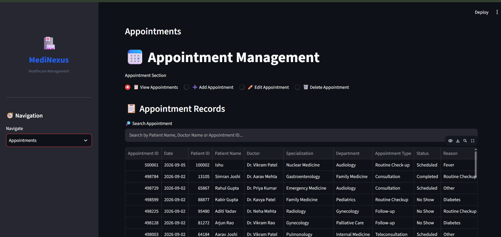

# MediNexus – Healthcare Management & Analytics Platform

MediNexus is a healthcare management and analytics platform built using **Python, Streamlit, MySQL, SQL, and Pandas**.

The project is designed to provide a centralized web interface for managing healthcare data and performing analysis on structured healthcare records.

## 📌 Project Overview

MediNexus currently focuses on the management of patients, doctors, departments, and appointments through an interactive web application.

The objective is to make healthcare data easier to manage, search, update, and analyze through a single interface.

## 🚀 Current Features

- 👤 Patient Management
- 👨‍⚕️ Doctor Management
- 🏥 Department Management
- 📅 Appointment Management

## 🛠️ Technology Stack

- **Python** – Application logic and data processing
- **Streamlit** – Interactive web application
- **MySQL** – Relational database
- **SQL** – Data retrieval, joins, filtering, and database operations
- **Pandas** – Data processing and analysis

## 🗄️ Database Structure

The project uses a relational MySQL database with interconnected tables.

### Main Relationships

- `patients` → `appointments`
- `doctors` → `appointments`
- `doctors` → `departments`

Primary keys and foreign keys are used to maintain relationships and data integrity between the tables.

## 📊 Dataset Scale

The project was developed and tested with large datasets, including approximately:

- **100,000+ patient records**
- **500,000+ appointment records**

## ⚡ Performance Optimization

One of the major challenges in the project was maintaining application responsiveness while working with large datasets.

The initial implementation loaded a large number of records into Pandas DataFrames, which increased loading time and reduced application responsiveness.

To improve performance, I implemented:

- Search-first data retrieval
- Limited result sets
- Targeted SQL queries
- Reduced unnecessary data loading
- More efficient database interaction
- Query optimization and indexing considerations

## 🔎 Patient Management

The Patient module allows users to:

- Search patients
- View patient information
- Add new patients
- Edit patient information
- Manage patient records through the web interface

## 👨‍⚕️ Doctor Management

The Doctor module allows users to:

- Search doctors
- View doctor information
- Add new doctors
- Edit doctor information
- Manage doctor specialization and department information
- Store experience and consultation fee details

## 📅 Appointment Management

The Appointment module allows users to:

- Search appointments
- Search patients by name or ID
- Select doctors
- Create new appointments
- Edit existing appointments
- Delete appointments with dependency checks
- View appointment, patient, doctor, and department information

## 🔐 Data Integrity

The project uses several database and application-level techniques to maintain data integrity:

- Primary keys
- Foreign keys
- Parameterized SQL queries
- Transaction handling
- Rollback on database errors
- Dependency checks before deletion

## 🎯 Project Objectives

The main objectives of MediNexus are:

1. To manage healthcare data through a centralized interface.
2. To understand and implement relational database concepts.
3. To use SQL for retrieving and combining data from multiple tables.
4. To process data using Python and Pandas.
5. To develop an interactive application using Streamlit.
6. To improve application performance when working with large datasets.

## 📚 Skills Demonstrated

This project demonstrates practical experience in:

- SQL
- MySQL
- Relational Database Design
- Python
- Pandas
- Streamlit
- Data Analysis
- Data Management
- Query Optimization
- Problem Solving

## 🔮 Future Scope

Additional healthcare modules and advanced analytics can be added to the platform as the project develops.

## 👨‍💻 Author

**Banti Chauhan**

GitHub: [@MrChauhan-2114](https://github.com/MrChauhan-2114)
